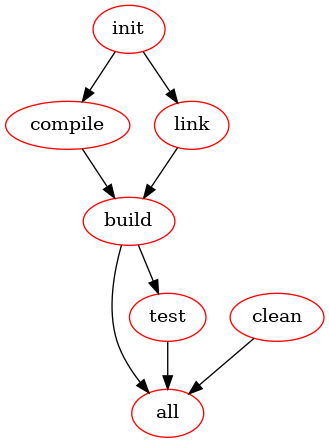

# README

Creates a graph of dependencies from GNU-Make using [make2graph](https://github.com/lindenb/makefile2graph).

```console
git clone https://github.com/lindenb/makefile2graph.git
cd makefile2graph
make
./make2graph --version
```
```
1.5.0
```

Install `graphviz`.

```console
sudo apt update
sudo apt install -y graphviz
```

`make`

* -B, --always-make
    * Unconditionally make all targets.
* -n, --just-print, --dry-run, --recon
    * Print the commands that would be executed, but do not execute them (except in certain circumstances).
* -d
    * Print debugging information in addition to normal processing.

```console
make -Bnd | ./make2graph | dot -Tpng -o out.png
```


